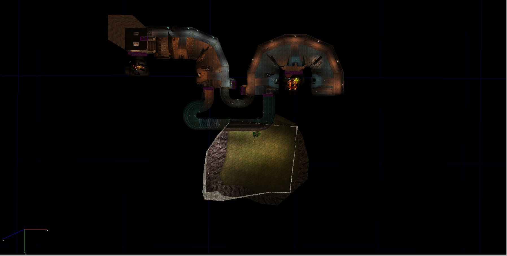
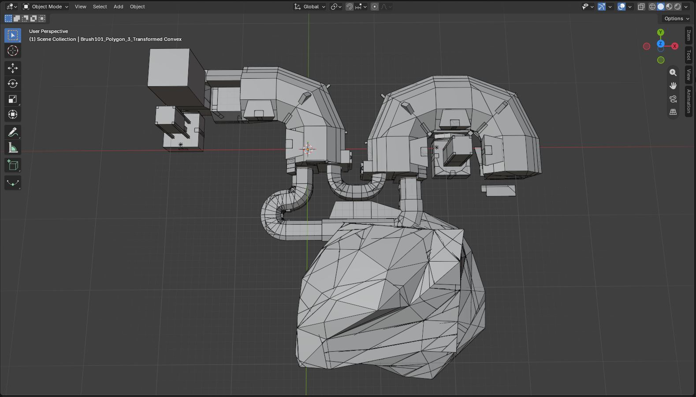
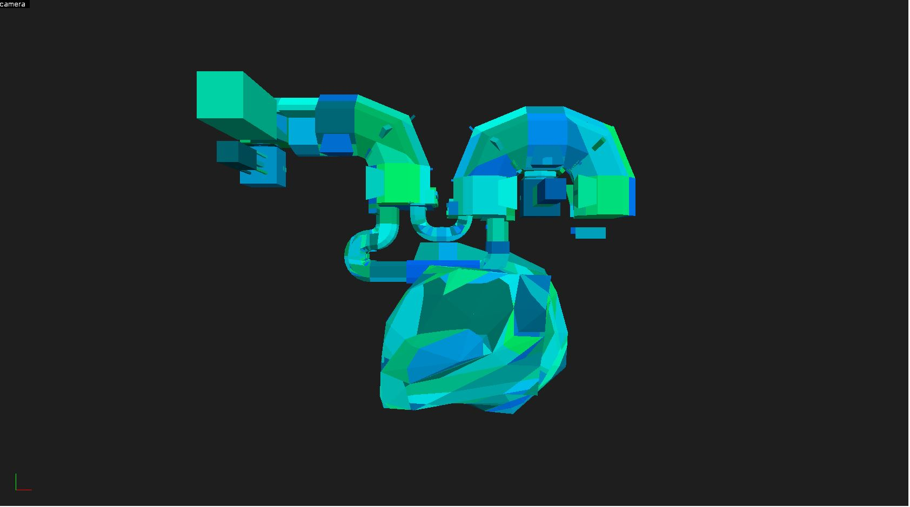

# UT99 `.t3d` → GMod/Source `.vmf` Converter

**A console tool that converts Unreal Tournament 99 (targeted) map exports (`.t3d`) into Valve `.vmf` files for Hammer Map Editor — including full concave-brush CSG decomposition into convex Source solids.**


<p align="center">
  
  
  
</p>

---

## Features

- **UT99 `.t3d` parsing** — buffered reader that decides each actor's concrete type at `End Actor` from the properties of the actor. Handles arbitrary UnrealScript subclasses (`GradualMover`, `AttachMover`, custom map classes, etc.)
- **Concave → Convex decomposition** — Recursive BSP-based plane splitting (Sutherland–Hodgman 3D clipping + cap generation) turns each concave brush into convex Source solids.
- **Actor conversion** — Brushes (additive/subtractive), movers (no behavior for now, just as brushes), lights (Unreal HSV → Source RGB), player starts, and level info.
- **Non-manifold handling** — Input brushes that are not a closed watertight volume are marked and reported rather than skipped or welded; degenerate cases fall back to a thin brush per polygon.
- **`.obj` dump** — Per-Brush geometry export for inspection in Blender.
- **Full logging** — Log file generated with brush/face/decomposition counts and timings.

---

## Quick start

**Drag & drop** a `.t3d` file onto the executable, or pass it as an argument:

```powershell
t3d_to_vmf_convertion.exe "C:\path\to\DM-Deck16][.t3d"
```

The tool writes its output into folders created next to the current working directory (see below), then prints a summary:

```
[INFO] Counted 254 brushes, 1532 brush faces and 0 unique !geometric! vertices
[INFO] Constructed .vmf in presumably 571 ms
[INFO] Finished Conversion
```

Open the resulting `.vmf` in Hammer. (Hammer++ preferred as most testing was done with it)

---

## Build

Requires the **.NET 8 SDK**.

```bash
git clone <this-repo>
cd t3d_to_vmf_convertion
dotnet build -c Release
```

---

## How it works

The pipeline is a straight read → decompose → map → write:

```
.t3d ──► T3DReader ──► BrushActor.Decompose ──► UnrealActorToVMF ──► VMFWriter ──► .vmf
             │               │                        │                  │
        buffered parse   concave→convex          UT actor → VMF      world solids
        type at EndActor  decomposition           counterpart         + entities
```

| Stage | File | Responsibility |
|-------|------|----------------|
| Read | `Core/Readers/T3DReader.cs` | Parse `.t3d`, buffer actor properties, resolve type at `End Actor` |
| Decompose | `Models/UT/Actors/BrushActors/BrushActor.cs` | Recursive plane-based splitting into convex pieces; non-manifold detection |
| Map | `Utils/Converters/UnrealActorToVMF.cs` | Convert a UT actor to its VMF counterpart |
| Write | `Core/Writers/VMF/VMFWriter.cs` | Emit `.vmf` world solids and entities |

Output uses Source `dev/dev_measuregeneric01` (additive) / `...01b` (subtractive) dev textures; coordinates are snapped to a `0.01` grid.

---

## Output & logging

| Folder | Contents |
|--------|----------|
| `t3d_to_vmf_vmfs/` | Generated `.vmf` files (`<mapname> <timestamp>.vmf`) |
| `t3d_to_vmf_logs/` | Conversion logs (INFO/WARNING/ERROR/DEBUG) |
| `t3d_to_vmf_objs/` | Per-brush `.obj` dumps |

In Debug builds the console shows all log levels; Release suppresses `DEBUG`-level console output but still writes it to the log file.

---

## Results

Measured against **38 real UT99 maps** (For extra detail see the last section of README):

| Metric | Value |
|--------|-------|
| Fully clean maps (0 non-manifold, 0 fallback) | **31 / 38 (82%)** |
| Output convex brushes | 43,278 |
| Brush faces | 259,561 |
| Concave decompositions | 12,397 |
| Non-manifold brushes | 34 (**0.08%** of brushes) |
| Thin-brush fallbacks | 30 (0.07%) |
| Avg faces per brush | 6.00 |

---

## Limitations

Organized by design consideration:

- **Fuzzy geometry core.** Vertex identity is reconstructed from coordinates via distance epsilons rather than exact identity. This is the root cause of the residual non-manifold cases and is the motivation for the planned major refactor.
- **Non-manifold residue.** ~34 brush splits across 5 maps cannot be closed watertight. Some are genuinely defective input (flipped triangles, zero-thickness geometry in a shape that's supposed to be watertight, concave polygons) that the tool marks honestly.
- **Geometry & basics only.** Brushes, lights, movers (no behavior replication yet) and player starts are converted. Game logic, triggers, keyframe animation, and most entity properties are **not** translated.
- **No brush sheering.** UT's sheer transform is not applied (not yet encountered).
- **Cross-platform, Windows-tested.** Plain .NET 8 console app — builds/runs on Windows, Linux, and macOS. Drag-and-drop is a Windows-only convenience (use a CLI argument elsewhere); development is Windows-based.
- **Garbage in Hammer.** There can be garbage corrupt brushes in your hammer due to several reasons: Tiny brush split/Bad plane coordinates/Out-of-bounds brush. This will all be taken care of (as most of the other problems) as the tool progresses. The garbage can be safely removed. Some brushes may have "too short edges", but at least in Hammer++ these can be fixed/tolerated via Alt+P menu
- **No CSG.** Self-explanatory, the CSG will be implemented once the decomposition is stable and well-written (See Planned section)

---

## Directory structure

```
t3d_to_vmf_convertion/
├─ Program.cs                          # Entry point: drag-drop / CLI arg, orchestrates read → write
├─ Core/
│  ├─ Readers/
│  │  └─ T3DReader.cs                  # Buffered .t3d parser; actor type decided at "End Actor"
│  └─ Writers/
│     ├─ VMF/VMFWriter.cs              # Emits .vmf world solids + entities
│     └─ Debug/OBJWriter.cs           # Per-brush .obj dump
├─ Models/
│  ├─ UT/                             # Unreal actors: BrushActor (CSG), MoverActor, LightActor, …
│  │  └─ UTPolygon.cs                 # Polygon: vertices, lazy normal, owner back-reference
│  └─ VMF/                            # Source/VMF output model (solids, sides, entities)
├─ Structs/
│  ├─ Geometry/                       # Vector, Plane, Edge, Angle + the epsilon constants
│  └─ Colors/                         # RGB and Unreal HSV conversion
└─ Utils/
   ├─ Converters/UnrealActorToVMF.cs  # Maps UT actors → VMF counterparts
   ├─ ActorFactory.cs                 # Builds concrete actor from observed properties
   └─ Logger.cs                       # File + console logging
```

---

## Planned

- [ ] Refactor code to better suit SOLID standards
- [ ] Replace coordinate-epsilon identity with exact identity. Removes the whole class of epsilon-tuning bugs.
- [ ] Reconstruction of CSG calculations to represent the actual map instead of CSG input brushes
- [ ] Broader entity / mover (keyframe) conversion
- [ ] Texture parsing
- [ ] Sound parsing
- [ ] Repair pass (coplanar overlap/zero thickness degeneracy removals, instant concave triangulation)
- [ ] Brush sheering support

---

## A note on the geometry approach

The current decomposer is a first crude step: it works on 82% of the tested maps cleanly, but it leans on a ladder of purpose-tuned distance epsilons (`CoordinateEpsilon`, `PlaneEpsilon`, `PerpDistanceEpsilon`, …) because a vertex has no identity beyond its (noisy) coordinates. That design is being reworked toward an exact representation, transitive and epsilon-free. Until then, the tool may behave incorrectly on some brushes. Input it cannot convert watertight is reported as non-manifold rather than skipped or deformed.

This is my first geometry project and this first iteration took me 7 months. However, I've learned enough to take a step back and re-do the first step, this time a lot better

---

## Map Tests

| Map | Brushes | Faces | NM | Fail | Decomps |
|-----|--------:|------:|---:|-----:|--------:|
| AS-Guardia | 783 | 4900 | 0 | 0 | 281 |
| AS-HiSpeed | 1375 | 8004 | 0 | 1 | 640 |
| AS-Mazon | 929 | 5708 | 0 | 0 | 319 |
| AS-OceanFloor | 732 | 4463 | 0 | 0 | 354 |
| AS-Overlord | 1172 | 7465 | 0 | 0 | 322 |
| AS-Rook | 1662 | 9916 | 3 | 3 | 458 |
| CityIntro | 1032 | 6323 | 0 | 0 | 279 |
| CTF-Command | 933 | 6148 | 0 | 0 | 388 |
| CTF-Coret | 1519 | 9150 | 0 | 0 | 188 |
| CTF-Cybrosis][ | 1968 | 12115 | 0 | 4 | 553 |
| CTF-Darji16 | 2581 | 16342 | 0 | 0 | 576 |
| CTF-Dreary | 1501 | 9258 | 0 | 0 | 556 |
| CTF-EpicBoy | 6119 | 32023 | 0 | 0 | 1094 |
| CTF-EternalCave | 954 | 5766 | 0 | 0 | 682 |
| CTF-Face | 411 | 2502 | 0 | 0 | 179 |
| CTF-Face-SE | 418 | 2538 | 0 | 0 | 179 |
| CTF-High | 1023 | 6174 | 0 | 0 | 42 |
| CTF-Kosov | 1451 | 8566 | 12 | 8 | 560 |
| CTF-LavaGiant | 569 | 3313 | 2 | 1 | 184 |
| CTF-Niven | 961 | 6049 | 0 | 0 | 485 |
| CTF-Noxion16 | 1480 | 8849 | 0 | 0 | 102 |
| CTF-Nucleus | 1418 | 9347 | 0 | 0 | 751 |
| CTF-Orbital | 1161 | 7212 | 10 | 6 | 314 |
| CTF-Ratchet | 1776 | 10596 | 0 | 0 | 342 |
| DM-Agony | 839 | 5078 | 0 | 0 | 46 |
| DM-Barricade | 1349 | 8169 | 0 | 0 | 95 |
| DM-Closer | 909 | 5658 | 0 | 0 | 201 |
| DM-Conveyor | 741 | 4620 | 0 | 0 | 242 |
| DM-Crane | 899 | 5427 | 0 | 0 | 16 |
| DM-Deck16][ | 254 | 1532 | 0 | 0 | 15 |
| DM-Deck17][ | 737 | 4615 | 7 | 7 | 511 |
| DM-KGalleon | 1121 | 6734 | 0 | 0 | 578 |
| DM-Morpheus | 379 | 2400 | 0 | 0 | 250 |
| DM-Peak | 573 | 3352 | 0 | 0 | 232 |
| DM-Pressure | 334 | 2053 | 0 | 0 | 20 |
| DM-Pyramid | 207 | 1138 | 0 | 0 | 0 |
| DOM-Cryptic | 847 | 5092 | 0 | 0 | 332 |
| EOL_Challenge | 161 | 966 | 0 | 0 | 31 |
| **Total** | **43278** | **259561** | **34** | **30** | **12397** |
